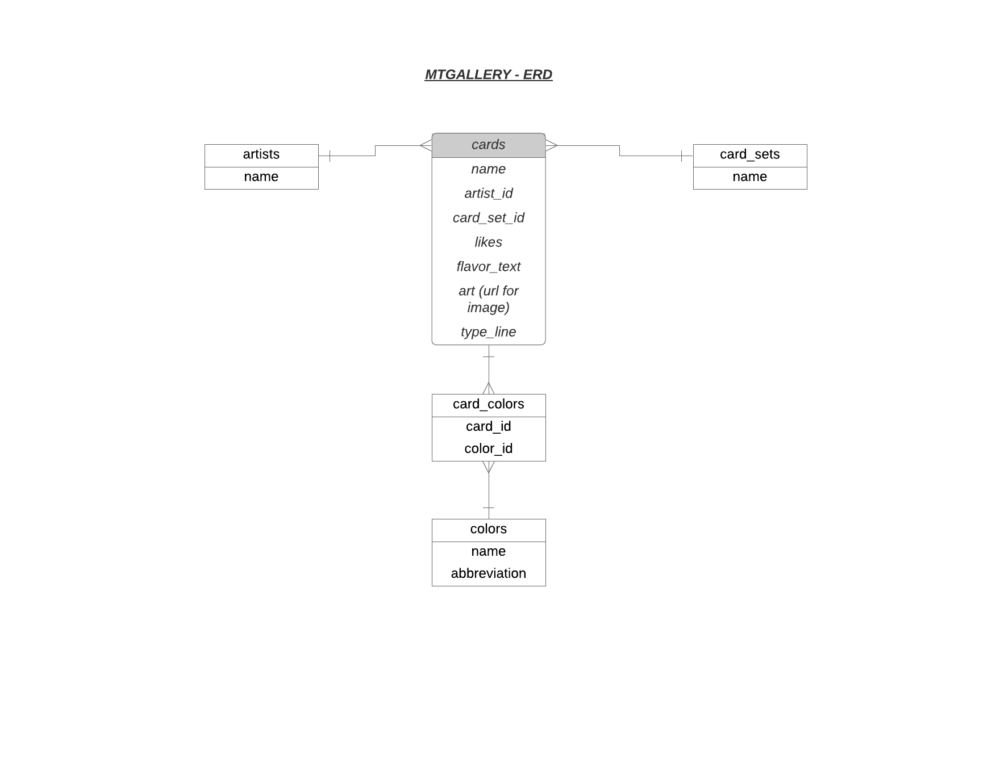

MAGIC THE GALLERY

View card art for over 40k cards from the populat card game in a gallery format!  Users can filter cards by color, lands, artists, and sets!  In addition art for cards can be liked- which is stored via Rails backend.  Page will render more cards on scroll to allow for near infinite viewing experience.

[Link To Sample Gallery](https://loganwohlers.github.io/magic-front "MTGALLERY")
(Note that due to Heroku limitations on database size- the above sample gallery only contains ~1500 cards-- If you would like to download the full files for 40k cards and run it locally please see below)

How it Works

The card data from this project came from the [Scryfall API](https://scryfall.com/docs/api "SCRYFALL API").  Due to the sheer size of gathering 40k+ cards- Scryfall has a [Bulk Download]https://scryfall.com/docs/api/bulk-data option which allows to data for cards to be downloaded locally as JSON data.  Each card object in this JSON file contains information about the card including it's colors, artist, set, name, flavor text, typing, effects, and links to multiple images of it's art in various resolutions.  As the goal of this project was to highight the actual art only cards containing high-res full art were actually seeded into the database.  In addition- data relating strictly to the game such as card stats, mana cost, and effects were intentionally ommitted.  Using this data a Rails PostgreSQL database was seeded utilizing Active Record ORM according to the below digram.  

In order to seed the data in just one iteration through the JSON card data-- the card Colors were pre-seeded with rows in the database being created for the 5 main colors (White(W) /Blue(U) /Black(B) /Red (R)/Green(G)) as well as Colorless(N) and Land(L) cards.  All colors  used a one letter abbreviation corresponding to commonly used Magic the Gathering abbreviations.  Colors and Cards have a many to many relationship so a card_colors join table was used. With colors seeded each JSON object was iterated through-- with new cards being created only for cards with the aformentioned high-res full card art attribute.  Every card was seeded with it's necessary attributes including the artist and set it belonged to- as well as colors it contained.  This data was then sent through a serializer for easy access to the information on the front end.

The front end itself is a Single Page Application built purely with vanilla javascript.  The homepage sends a request to the backend for 100 random cards to start.  Users can then interact with the page--by filtering with Color, Set, or Artist or by clicking a card itself-- which renders a modal containing more information about the card- as well as giving the user to like the card (which will persist in the database).  When a user scrolls to the bottom of a page- more cards will be rendered- allowing for a near infinite scroll.  Every previous query by the user is stored in a variable- so the new cards rendered will be relevant to whatver they were viewing (ie only more cards from the same Artist/Color/Set will be rendered on the screen)

How to Get Full Gallery

If 1500 cards is not enough (I understand) the [Bulk Download]https://scryfall.com/docs/api/bulk-data option from Scryfall is an option.  To set up the project you will need to fork/clone the front and back end from GitHub in order to run them on your local machine.  In the Rails backend- download the Bulk Option of your choosing and create a new file for it.  

Then in the seeds.rb file change filepath for the jason_hash variable to whatever you've named your JSON file.
data_hash = JSON.parse(File.read(YOUR_LOCAL_PATH_HERE)

Then run rake db migrate && rake db:seed (note that this takes a very long time for the full 40k cards).  Once the data is seeded in the backend simply run the index.html file in the frontend in your browser.

Technologies Used

[Scryfall API](https://scryfall.com/docs/api "SCRYFALL API")

Vanilla Javascript

Ruby on Rails

Created By 

Logan Wohlers

Thanks for Reading!

